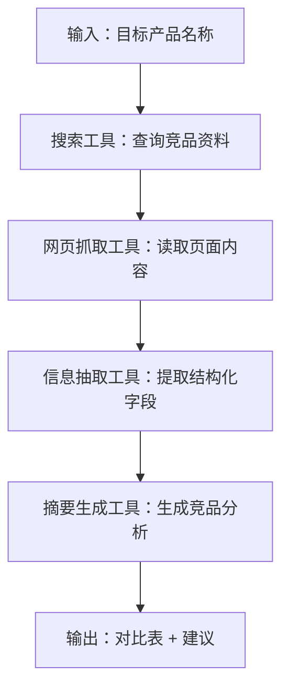
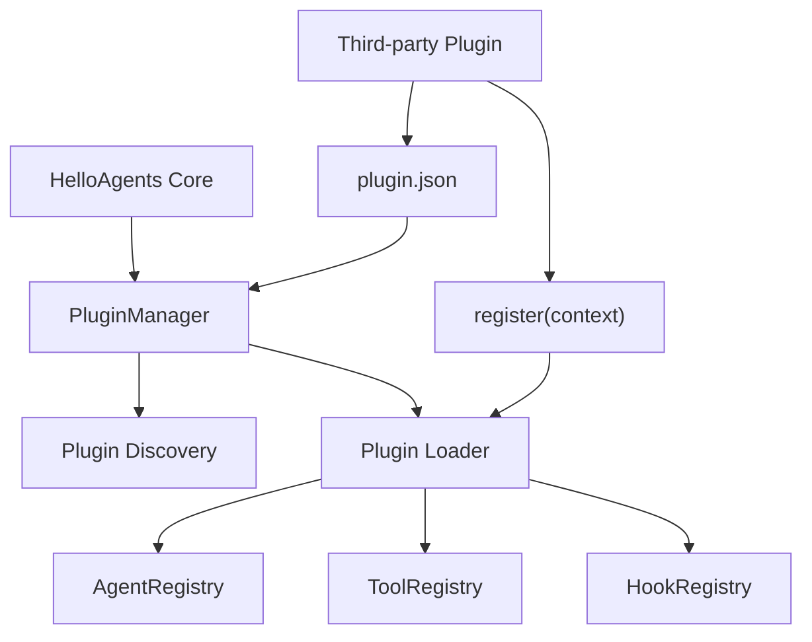

# 第七章 构建你的智能体框架 - 习题答案

> 原网页：https://datawhalechina.github.io/hello-agents/#/./chapter7/%E7%AC%AC%E4%B8%83%E7%AB%A0%20%E6%9E%84%E5%BB%BA%E4%BD%A0%E7%9A%84Agent%E6%A1%86%E6%9E%B6

## 1. 自建 Agent 框架的价值与设计取舍

### 原题目

本章构建了 `HelloAgents` 框架，并阐述了“为何需要自建Agent框架”。请分析：

- 在7.1.1节中提到了当前主流框架的四个主要局限性。结合你在第六章习题或实际项目中使用过的某个框架的实际经验，说明这些问题是如何影响开发效率的。
- `HelloAgents` 提出了“万物皆为工具”的设计理念，将 `Memory`、`RAG`、`MCP` 等模块都抽象为工具。这种设计有什么优势？是否存在局限性？请举例说明。
- 对比第四章从零实现的智能体代码和本章的框架化实现，框架化带来了哪些具体的改进？如果让你设计一个框架，你会优先考虑哪些设计原则？

### 答案

主流 Agent 框架的四个局限会直接影响开发效率。

第一，过度抽象会让简单任务变复杂。以 LangChain 一类框架为例，开发者想完成一次“模型调用 + 工具调用”，往往需要先理解 Chain、Agent、Tool、Memory、Retriever、Callback 等概念。抽象层越多，定位问题时越难判断错误来自提示词、框架封装、工具参数，还是模型返回格式。

第二，快速迭代会带来维护成本。框架 API 频繁变化时，原本可运行的示例可能因为类名、参数名、导入路径调整而失效。学习者会把大量时间花在“让旧代码重新跑起来”上，而不是理解 Agent 的核心机制。

第三，黑盒封装会降低可解释性。成熟框架通常把 prompt 拼接、工具选择、历史裁剪、函数调用解析等逻辑封装在内部。一旦 Agent 输出异常，开发者不容易观察中间状态，也难以精确修改某个环节。

第四，依赖复杂会增加集成风险。大型框架常带来大量第三方依赖，在已有项目中可能引发版本冲突、安装缓慢、部署镜像膨胀等问题，尤其在教学、轻量原型和受限环境中很不友好。

“万物皆为工具”的优势是降低认知成本。学习者只要理解 Agent 可以调用 Tool，就能把计算器、搜索、RAG、Memory、MCP 服务都看作“接收输入并返回结果”的能力模块。这样可以统一注册、统一描述、统一执行，也便于 ReAct、Plan-and-Solve 等 Agent 共用同一套工具系统。

它的局限是：不是所有模块都天然适合被简化成一次性工具调用。比如 Memory 可能需要长期状态、检索策略、写入策略和过期策略；RAG 可能包含文档加载、切分、向量化、召回、重排、引用生成等流水线；MCP 可能涉及连接生命周期和权限边界。如果一律只抽象为 `execute(input) -> output`，复杂模块的内部状态和治理能力可能被隐藏。

相对第四章从零实现的代码，本章框架化实现带来了这些改进：

- 统一接口：所有 Agent 都有一致的 `run` 入口，调用方式更稳定。
- 统一消息系统：用 `Message` 类管理角色、内容和元数据，减少散乱字典。
- 统一 LLM 层：不同模型供应商通过 `HelloAgentsLLM` 适配，上层 Agent 不直接依赖某个厂商。
- 统一工具系统：工具注册、描述生成、执行和错误处理集中管理。
- 更容易测试：每个模块职责更单一，可以分别测试 LLM、Agent、Tool、Config。
- 更容易扩展：新增 Agent 范式或工具时，不需要重写整套基础设施。

如果让我设计一个 Agent 框架，我会优先考虑这些原则：轻量可读、接口稳定、职责单一、可观测、易测试、可扩展、向标准协议靠拢。也就是说，核心逻辑要尽量透明，扩展点要清晰，默认能力要够用，但不要为了“全能”牺牲学习成本和可维护性。

## 2. HelloAgentsLLM 多供应商与本地模型扩展

### 原题目

在7.2节中，我们扩展了 `HelloAgentsLLM` 以支持多模型供应商和本地模型调用。

提示：这是一道实践题，建议实际操作。

- 参考7.2.1节的示例，尝试为 `HelloAgentsLLM` 添加一个新模型供应商的支持（如`Gemini`、`Anthropic`、`Kim`）。要求通过继承方式实现，并能够自动检测该提供商的环境变量。
- 在7.2.3节中介绍了自动检测机制的三个优先级。请分析：如果同时设置了 `OPENAI_API_KEY` 和 `LLM_BASE_URL="http://localhost:11434/v1"`，框架最后会选择哪个提供商？这种优先级设计是否合理？
- 除了本章介绍的 `VLLM` 和 `Ollama`，还有 `SGLang` 等其他本地模型部署方案。请先搜索并了解 `SGLang` 的基本信息和特点，然后对比 `VLLM`、`SGLang` 和 `Ollama` 这三者在易用性、资源占用、推理速度、推理精度等方面的优劣。

### 答案

可以通过继承 `HelloAgentsLLM` 的方式新增 Gemini 供应商。核心思路是：当 `provider="gemini"` 或自动检测到 `GEMINI_API_KEY` 时，子类负责设置 Gemini 的 `api_key`、`base_url` 和默认模型；其他 provider 仍交给父类处理。

如果同时设置 `OPENAI_API_KEY` 和 `LLM_BASE_URL="http://localhost:11434/v1"`，按照本章 7.2.3 的优先级，框架会先检查特定服务商环境变量，所以会选择 OpenAI，而不是根据 `LLM_BASE_URL` 选择 Ollama。这个设计总体合理，因为显式的服务商密钥通常比通用 base_url 更能表达用户意图；但也有一个风险：用户可能希望临时切到本地 Ollama，却忘记清理 `OPENAI_API_KEY`。更稳妥的做法是允许 `provider` 显式参数拥有最高优先级，并在检测到“密钥与 base_url 明显冲突”时输出警告。

SGLang 是一个面向大语言模型和多模态模型的高性能服务框架，强调低延迟、高吞吐、结构化生成和复杂 LLM 程序执行。它适合需要结构化输出、Agent 工作流、多轮对话、RAG 流水线和高性能服务的场景。vLLM 的优势在于高吞吐推理服务，典型能力包括 PagedAttention、连续批处理、OpenAI 兼容服务接口等。Ollama 则更偏向本地易用性，提供简单命令行、模型管理和本地 REST API。

三者对比如下：

| 维度 | vLLM | SGLang | Ollama |
| --- | --- | --- | --- |
| 易用性 | 中等，需要理解服务参数、模型路径、GPU 配置 | 中等偏高，服务能力强，但高级参数较多 | 最高，安装后 `ollama run` 即可体验 |
| 资源占用 | 面向服务端吞吐优化，通常更依赖 GPU 资源 | 面向高性能服务，也更偏 GPU 服务场景 | 可在个人电脑上轻量运行，适合本地开发 |
| 推理速度 | 高，适合批量请求和生产服务 | 高，尤其适合结构化生成、Agent、多轮程序化调用 | 通常不以极限吞吐为目标，更重视本地体验 |
| 推理精度 | 主要取决于模型本身，框架影响较小 | 主要取决于模型本身；结构化输出约束可提升格式可靠性 | 主要取决于模型本身和量化版本 |
| 典型场景 | 在线推理服务、OpenAI 兼容 API、高并发 | 复杂 Agent 程序、结构化生成、高性能多模态服务 | 个人开发、本地测试、快速拉起开源模型 |

参考资料：[SGLang 官方文档](https://docs.sglang.io/)、[vLLM 官方文档](https://docs.vllm.ai/en/latest/)、[Ollama API 文档](https://github.com/ollama/ollama/blob/main/docs/api.md)。

### 代码回答

```python
# my_gemini_llm.py
import os
from typing import Optional
from hello_agents import HelloAgentsLLM


class MyGeminiLLM(HelloAgentsLLM):
    """通过继承方式为 HelloAgentsLLM 增加 Gemini provider。"""

    def __init__(
        self,
        model: Optional[str] = None,
        api_key: Optional[str] = None,
        base_url: Optional[str] = None,
        provider: Optional[str] = "auto",
        **kwargs,
    ):
        detected_provider = provider
        if provider == "auto" and os.getenv("GEMINI_API_KEY"):
            detected_provider = "gemini"

        if detected_provider == "gemini":
            self.provider = "gemini"
            self.api_key = api_key or os.getenv("GEMINI_API_KEY")
            self.base_url = base_url or "https://generativelanguage.googleapis.com/v1beta/openai/"
            self.model = model or os.getenv("GEMINI_MODEL", "gemini-1.5-flash")

            if not self.api_key:
                raise ValueError("Gemini API key not found. Please set GEMINI_API_KEY.")

            super().__init__(
                model=self.model,
                api_key=self.api_key,
                base_url=self.base_url,
                provider="openai_compatible",
                **kwargs,
            )
            self.provider = "gemini"
            return

        super().__init__(
            model=model,
            api_key=api_key,
            base_url=base_url,
            provider=provider,
            **kwargs,
        )
```

```python
# test_my_gemini_llm.py
from dotenv import load_dotenv
from my_gemini_llm import MyGeminiLLM

load_dotenv()

llm = MyGeminiLLM(provider="auto")
response = llm.think([
    {"role": "user", "content": "请用一句话解释什么是 Agent 框架。"}
])
print(response)
```

## 3. Message、Config 与 Agent 抽象基类

### 原题目

在7.3节中，我们实现了 `Message` 类、`Config` 类和 `Agent` 基类。请分析：

- `Message` 类使用了 `Pydantic` 的 `BaseModel` 进行数据验证。这种设计在实际应用中有哪些优势？
- `Agent` 基类定义了 `run` 和 `_execute` 两个方法，其中 `run` 是公开接口，`_execute` 是抽象方法。这种设计模式叫什么？有什么好处？
- 在 `Config` 类中，我们使用了单例模式。请解释什么是单例模式，为什么配置管理需要使用单例模式？如果不使用单例会导致什么问题？

### 答案

`Message` 使用 Pydantic 的优势主要有四点。

第一，数据结构更可靠。`role`、`content`、`metadata` 等字段可以被自动校验，避免错误消息进入 LLM 调用链路。第二，错误更早暴露。如果某个模块传入了空内容、非法角色或错误类型，校验层会尽早抛出异常，而不是等到模型调用失败。第三，序列化更方便。Pydantic 模型可以稳定转换为字典或 JSON，便于日志记录、持久化和 API 传输。第四，代码更可读。消息对象比散乱字典更能表达领域含义。

`run` + `_execute` 属于模板方法模式。`run` 固定公共流程，比如接收输入、记录历史、异常处理、调用执行逻辑、保存输出；`_execute` 作为抽象方法交给子类实现具体 Agent 范式。好处是公共流程只写一次，SimpleAgent、ReActAgent、ReflectionAgent 等子类只关注自己的推理策略，从而减少重复代码并提高一致性。

单例模式指一个类在整个程序生命周期中只创建一个共享实例，并提供统一访问入口。配置管理适合使用单例，因为 API key、模型名、默认超时、日志等级等配置应该全局一致。如果不使用单例，不同模块可能读取到不同配置实例，导致同一个程序里 Agent A 用 OpenAI，Agent B 却用 Ollama；或者某处修改了配置，其他模块无法感知，最终造成难以排查的不一致行为。

## 4. 四种 Agent 范式的框架化实现

### 原题目

在7.4节中，我们动手进行了四种 `Agent` 范式的框架化实现。

提示：这是一道实践题，建议实际操作。

- 对比第四章从零实现的 `ReActAgent` 和本章框架化的 `ReActAgent`，列举3个具体的改进点，并说明这些改进如何提升了代码的可维护性和可扩展性。
- `ReflectionAgent` 实现了“执行-反思-优化”循环。请扩展这个实现，添加一个“质量评分”机制：在每次反思后，让 `LLM` 对当前版本的输出打分，只有分数低于阈值时才继续优化，否则提前终止。
- 请设计并实现一个新的 `Agent` 范式 `Tree-of-Thought Agent`，要求继承 `Agent` 基类，它能够在每一步生成多个可能的思考路径，然后选择最优路径继续。

### 答案

本章框架化 `ReActAgent` 相比第四章从零实现，至少有三点改进。

第一，继承统一的 `Agent` 基类。公共的运行入口、历史管理和基础属性由基类提供，ReAct 只需要实现 Thought、Action、Observation 的循环逻辑。这样可以减少重复代码。

第二，接入统一工具注册表。第四章可能直接在代码里写死工具函数，本章可以通过 `ToolRegistry` 注册、查找和执行工具。新增工具时不必修改 ReActAgent 主逻辑，可扩展性更好。

第三，提示词和解析逻辑更标准。框架化实现通常会明确约束输出格式，例如 `Thought`、`Action`、`Finish`，并用独立方法解析工具调用。这样错误更容易定位，也便于后续替换为函数调用或结构化输出。

质量评分版 `ReflectionAgent` 的思路是：每轮先生成答案，再反思，再让 LLM 给当前答案打分。如果分数达到阈值，就提前停止；如果分数不足，再根据反馈优化。这样可以避免固定迭代次数带来的浪费。

`Tree-of-Thought Agent` 的核心思想是：每一步不只生成一条思路，而是生成多个候选思考路径，对候选路径评分，保留最优路径继续展开。它适合数学推理、规划、复杂决策等需要探索多个可能解的问题。

### 代码回答

```python
# scored_reflection_agent.py
import re
from hello_agents import Agent


class ScoredReflectionAgent(Agent):
    def __init__(self, name, llm, max_iterations=3, score_threshold=8.0):
        super().__init__(name=name, llm=llm)
        self.max_iterations = max_iterations
        self.score_threshold = score_threshold

    def _execute(self, task: str) -> str:
        answer = self.llm.think([
            {"role": "user", "content": f"请完成任务：{task}"}
        ])

        for _ in range(self.max_iterations):
            critique = self.llm.think([
                {
                    "role": "user",
                    "content": (
                        "请评价下面回答的问题，并指出可改进之处。\n"
                        f"任务：{task}\n回答：{answer}"
                    ),
                }
            ])

            score_text = self.llm.think([
                {
                    "role": "user",
                    "content": (
                        "请只输出 0 到 10 的分数，不要输出其他内容。\n"
                        f"任务：{task}\n回答：{answer}\n反馈：{critique}"
                    ),
                }
            ])
            score = self._parse_score(score_text)

            if score >= self.score_threshold:
                return answer

            answer = self.llm.think([
                {
                    "role": "user",
                    "content": (
                        "请根据反馈优化回答。\n"
                        f"任务：{task}\n当前回答：{answer}\n反馈：{critique}"
                    ),
                }
            ])

        return answer

    @staticmethod
    def _parse_score(text: str) -> float:
        match = re.search(r"\d+(?:\.\d+)?", text)
        return float(match.group()) if match else 0.0
```

```python
# tree_of_thought_agent.py
import re
from hello_agents import Agent


class TreeOfThoughtAgent(Agent):
    def __init__(self, name, llm, branches=3, depth=3):
        super().__init__(name=name, llm=llm)
        self.branches = branches
        self.depth = depth

    def _execute(self, task: str) -> str:
        path = []

        for step in range(1, self.depth + 1):
            candidates = self._generate_candidates(task, path, step)
            best = self._select_best(task, path, candidates)
            path.append(best)

        return self.llm.think([
            {
                "role": "user",
                "content": (
                    "请根据下面的最佳思考路径，给出最终答案。\n"
                    f"任务：{task}\n思考路径：{path}"
                ),
            }
        ])

    def _generate_candidates(self, task, path, step):
        prompt = (
            f"任务：{task}\n"
            f"已有思考路径：{path}\n"
            f"请为第 {step} 步生成 {self.branches} 个不同的候选思路，"
            "每行一个候选。"
        )
        text = self.llm.think([{"role": "user", "content": prompt}])
        candidates = [line.strip("- 0123456789.、") for line in text.splitlines()]
        return [item for item in candidates if item][: self.branches]

    def _select_best(self, task, path, candidates):
        prompt = (
            f"任务：{task}\n"
            f"已有路径：{path}\n"
            f"候选思路：{candidates}\n"
            "请选择最优候选，只输出候选序号。"
        )
        text = self.llm.think([{"role": "user", "content": prompt}])
        match = re.search(r"\d+", text)
        index = int(match.group()) - 1 if match else 0
        index = max(0, min(index, len(candidates) - 1))
        return candidates[index]
```

## 5. 工具系统设计

### 原题目

在7.5节中，我们构建了工具系统。请思考以下问题：

- `BaseTool` 类定义了 `execute` 抽象方法，所有工具都必须实现这个方法。请解释为什么要强制所有工具实现统一的接口？如果某个工具需要返回多个值（如搜索工具返回标题、摘要、链接），应该如何设计？
- 在7.5.3节中实现了工具链（`ToolChain`）。请设计一个实际的应用场景，需要串联至少3个工具，并画出工具链的执行流程图。
- 异步工具执行器（`AsyncToolExecutor`）使用了线程池来并行执行工具。请分析：在什么情况下并行执行工具能带来性能提升？

### 答案

强制所有工具实现统一接口，是为了让 Agent 不需要关心工具内部差异。只要工具都遵循 `execute(input)` 或 `execute(**kwargs)` 这样的协议，Agent 就能用同一套流程完成工具描述生成、工具选择、参数传递、异常处理和结果读取。统一接口还能让工具注册表更简单，也便于测试和替换实现。

如果工具需要返回多个值，推荐返回结构化对象，而不是拼接字符串。例如搜索工具可以返回：

```python
{
    "results": [
        {"title": "标题", "snippet": "摘要", "url": "链接"}
    ],
    "source": "tavily",
    "query": "原始查询"
}
```

如果当前框架要求工具返回字符串，也可以先在工具内部用 JSON 字符串序列化；但更长期的设计应允许工具返回 `dict`、`list` 或 Pydantic 模型，再由 Agent 决定如何展示给 LLM。

一个实际工具链场景是“自动生成竞品调研摘要”，串联 4 个工具：

1. 搜索工具：搜索目标产品和竞品资料。
2. 网页抓取工具：读取搜索结果中的网页正文。
3. 信息抽取工具：抽取价格、功能、目标用户、优缺点。
4. 摘要生成工具：生成对比表和结论。

流程图：



并行执行工具在这些情况下能提升性能：

- 多个工具之间没有依赖关系，例如同时搜索多个关键词。
- 工具主要是 I/O 密集型任务，例如网络搜索、网页抓取、数据库查询、文件读取。
- 单个工具调用延迟较高，但 CPU 计算压力不大。
- 外部服务允许并发请求，并且不会触发严格限流。

并行不一定总是更好。如果任务是 CPU 密集型，Python 线程池可能受 GIL 影响；如果工具之间有前后依赖，就无法并行；如果外部 API 有低限流，并发还可能导致失败率上升。

## 6. 扩展 HelloAgents：流式输出、多轮对话与插件系统

### 原题目

框架的可扩展性是设计的重要考量因素之一。你现在要扩展 `HelloAgents` 框架，为其实现一些有趣的新功能和特性。

- 首先为 `HelloAgents` 添加一个“流式输出”功能，使得 `Agent` 在生成响应时能够实时返回中间结果（类似 `ChatGPT` 用户界面的打字效果）。请设计这个功能的实现方案，说明需要修改哪些类和方法。
- 然后为框架添加“多轮对话管理”功能，能够自动管理对话历史、支持对话分支和回溯，你会如何设计？需要新增哪些类？如何与现有的 `Message` 系统集成？
- 最后请为 `HelloAgents` 设计一个“插件系统”，允许第三方开发者通过插件的方式扩展框架功能（如添加新的 `Agent` 类型、新的工具类型等），而无需修改框架核心代码。要求画出插件系统的架构图并说明关键接口。

### 答案

流式输出需要从 LLM 层向 Agent 层传递 token 或 chunk。可以在 `HelloAgentsLLM` 中新增 `stream_think(messages)`，返回一个迭代器；在 `Agent` 基类中新增 `stream_run(input)`，负责记录用户消息、逐块产出模型响应，并在结束后把完整回答写入历史。具体 Agent 如果有工具调用，还需要决定哪些阶段可以流式输出：普通回答可以逐 token 输出，工具调用阶段则应先产出状态事件，再产出最终答案。

多轮对话管理可以新增 `Conversation`、`ConversationNode` 和 `ConversationManager`。`ConversationNode` 保存一条或一组 `Message`，并记录父节点和子节点；`Conversation` 管理一棵对话树；`ConversationManager` 提供创建会话、追加消息、创建分支、回溯到某个节点、导出上下文等能力。它与现有 `Message` 系统的关系是：节点里不重新发明消息格式，而是直接保存 `Message` 对象。

插件系统可以采用“插件声明 + 注册入口 + 生命周期钩子”的设计。第三方插件提供一个 `plugin.json` 或 Python 入口函数，声明插件名称、版本、提供的 Agent 类型、Tool 类型和配置项。框架启动时由 `PluginManager` 扫描插件，调用插件的 `register(registry)` 方法，把新 Agent 和 Tool 注册到对应注册表中。

插件系统架构图：



关键接口可以包括：

- `PluginManager.discover(path)`：发现可用插件。
- `PluginManager.load(plugin_name)`：加载插件模块。
- `Plugin.register(context)`：插件注册入口。
- `context.register_agent(name, cls)`：注册新 Agent 类型。
- `context.register_tool(name, tool)`：注册新工具。
- `context.register_hook(event, handler)`：注册生命周期钩子。

### 代码回答

```python
# streaming_llm.py
class StreamingHelloAgentsLLM:
    def stream_think(self, messages, **kwargs):
        stream = self.client.chat.completions.create(
            model=self.model,
            messages=messages,
            stream=True,
            **kwargs,
        )
        for chunk in stream:
            delta = chunk.choices[0].delta.content
            if delta:
                yield delta
```

```python
# streaming_agent.py
from hello_agents import Agent, Message


class StreamingAgent(Agent):
    def stream_run(self, user_input: str):
        self.history.append(Message(role="user", content=user_input))
        messages = [message.model_dump() for message in self.history]

        chunks = []
        for chunk in self.llm.stream_think(messages):
            chunks.append(chunk)
            yield chunk

        final_answer = "".join(chunks)
        self.history.append(Message(role="assistant", content=final_answer))
```

```python
# conversation_manager.py
from dataclasses import dataclass, field
from typing import Optional
from uuid import uuid4
from hello_agents import Message


@dataclass
class ConversationNode:
    messages: list[Message]
    parent_id: Optional[str] = None
    id: str = field(default_factory=lambda: str(uuid4()))
    children: list[str] = field(default_factory=list)


class Conversation:
    def __init__(self):
        self.nodes: dict[str, ConversationNode] = {}
        self.current_id: Optional[str] = None

    def append(self, messages: list[Message]) -> str:
        node = ConversationNode(messages=messages, parent_id=self.current_id)
        self.nodes[node.id] = node
        if self.current_id:
            self.nodes[self.current_id].children.append(node.id)
        self.current_id = node.id
        return node.id

    def checkout(self, node_id: str):
        if node_id not in self.nodes:
            raise ValueError(f"Conversation node not found: {node_id}")
        self.current_id = node_id

    def get_context(self) -> list[Message]:
        path = []
        node_id = self.current_id
        while node_id:
            node = self.nodes[node_id]
            path.append(node)
            node_id = node.parent_id

        messages = []
        for node in reversed(path):
            messages.extend(node.messages)
        return messages
```

```python
# plugin_system.py
class PluginContext:
    def __init__(self, agent_registry, tool_registry, hook_registry):
        self.agent_registry = agent_registry
        self.tool_registry = tool_registry
        self.hook_registry = hook_registry

    def register_agent(self, name, agent_cls):
        self.agent_registry[name] = agent_cls

    def register_tool(self, name, tool):
        self.tool_registry.register_tool(name, tool)

    def register_hook(self, event, handler):
        self.hook_registry.setdefault(event, []).append(handler)


class PluginManager:
    def __init__(self, context):
        self.context = context
        self.plugins = {}

    def load(self, plugin_module):
        plugin_module.register(self.context)
        self.plugins[plugin_module.__name__] = plugin_module
```

```python
# example_plugin.py
from hello_agents import BaseTool


class TimeTool(BaseTool):
    name = "time"
    description = "返回当前时间。"

    def execute(self, input_data: str = ""):
        from datetime import datetime
        return datetime.now().isoformat()


def register(context):
    context.register_tool("time", TimeTool())
```
