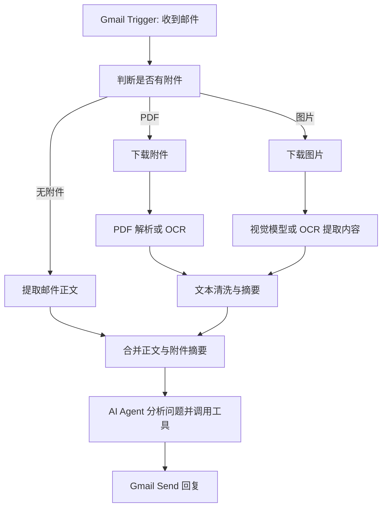
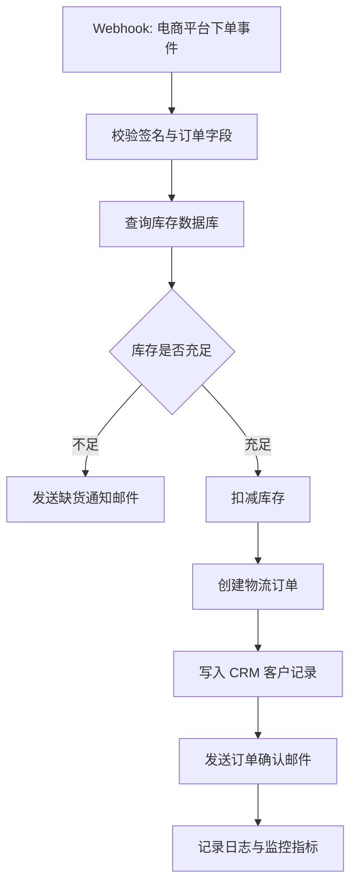

# 第五章习题与参考答案：基于低代码平台的智能体搭建

原文链接：https://datawhalechina.github.io/hello-agents/#/./chapter5/%E7%AC%AC%E4%BA%94%E7%AB%A0%20%E5%9F%BA%E4%BA%8E%E4%BD%8E%E4%BB%A3%E7%A0%81%E5%B9%B3%E5%8F%B0%E7%9A%84%E6%99%BA%E8%83%BD%E4%BD%93%E6%90%AD%E5%BB%BA

整理日期：2026-05-14

## 1. Coze、Dify、n8n 的定位差异与开发模式选择

### 题目

本章介绍了三个各具特色的低代码平台：`Coze`、`Dify` 和 `n8n`。请分析：

- 这三个平台在核心定位和设计理念上有什么区别？它们分别解决了智能体开发中的哪些痛点？
- 低代码平台与纯代码开发各有优劣，此外，也有部分功能用平台实现、部分功能用代码实现的“混合开发”模式。思考三种开发模式分别适合哪些场景？请举例说明。

### 参考答案

`Coze` 的定位更接近零代码/低代码智能体创作平台，强调上手快、界面友好、插件丰富和多渠道发布。它主要解决非技术用户不会写代码、开发者想快速验证创意、应用需要快速分发的问题。典型场景是做一个 AI 简报助手、客服机器人、内容生成小工具，然后快速发布到飞书、微信、豆包等渠道。

`Dify` 的定位是开源 LLM 应用开发与运营平台，强调从原型构建到生产部署的一站式能力。它主要解决企业级 AI 应用中的模型接入、RAG、Agent 编排、工具插件、数据管理、部署运维等问题。典型场景是企业知识库问答、合同审核、内部助手、复杂多智能体个人助手。

`n8n` 的定位是通用工作流自动化平台，不是纯 LLM 平台。它的核心设计理念是“连接”，把邮件、数据库、CRM、API、表格、模型节点串成自动化流程。它主要解决 AI 能力如何嵌入已有业务系统和复杂流程的问题。典型场景是智能邮件回复、订单处理自动化、研发流程自动化。

三种开发模式的选择可以这样理解：

| 开发模式 | 优势 | 局限 | 适合场景 | 示例 |
| --- | --- | --- | --- | --- |
| 低代码平台 | 快速搭建、可视化调试、门槛低、生态丰富 | 定制能力和性能上限受平台约束 | 原型验证、标准流程、非技术团队参与 | 用 Coze 做每日 AI 简报 |
| 纯代码开发 | 灵活、可控、可深度优化、便于版本管理 | 开发周期长、维护成本高、需要工程能力 | 高并发、复杂算法、强合规、深度定制 | 自研金融风控 Agent 服务 |
| 混合开发 | 兼顾效率与控制力 | 架构设计更复杂，需要管理平台与代码边界 | 先用平台搭业务流程，再用代码实现关键能力 | 用 Dify 编排流程，用自研 API 做合同条款识别 |

复习要点：低代码不是替代代码，而是把常见能力抽象成平台组件。实际项目中常见的最佳策略是“低代码做标准化流程，代码做差异化能力”。

## 2. Coze 每日 AI 简报案例扩展

### 题目

在 5.2 节的 `Coze` 案例中，我们构建了一个“每日AI简报”智能体。请基于此案例进行扩展思考：

- 当前的简报生成是被动触发的。如何改造这个智能体，使其能够每天早上 8 点自动生成简报并推送到指定的飞书群或微信公众号？
- 简报的质量高度依赖于提示词设计。请尝试优化 5.2.2 节中的提示词，使生成的简报更加专业、结构更清晰，或者增加“热点分析”“趋势预测”等新功能。
- `Coze` 当前不支持 `MCP` 协议被认为是一个重要局限。请简述什么是 `MCP` 协议？它为什么重要？如果 `Coze` 未来支持 `MCP`，会带来哪些新的可能性？

### 参考答案

要把“每日 AI 简报”从被动触发改造成每天早上 8 点自动推送，可以按以下思路设计：

1. 增加定时触发能力。使用 Coze 内置的定时任务、工作流触发器，或借助外部平台如飞书自动化、n8n、云函数、定时 HTTP 请求，在每天 8:00 触发简报工作流。
2. 保留原来的信息源插件。RSS、GitHub、arXiv 等数据源继续负责抓取新闻、论文和开源项目。
3. 增加内容清洗和去重。对标题相似、来源重复、低相关性内容进行过滤，避免简报堆砌。
4. 增加结构化生成节点。让大模型按固定栏目输出，例如“今日摘要”“技术新闻”“论文进展”“开源项目”“热点分析”“趋势判断”。
5. 增加发布节点。飞书可以通过群机器人 Webhook 推送，微信公众号可以通过草稿箱 API 或第三方发布工具完成推送。
6. 增加失败重试和日志。若某个信息源抓取失败，应降级输出，并记录失败来源，避免整个工作流中断。

一个更适合简报生成的提示词可以这样写：

```text
你是一名资深 AI 科技媒体编辑。请基于输入的信息源，生成一份面向 AI 从业者的每日简报。

目标：
1. 只保留与 AI、LLM、AIGC、Agent、机器人、开源模型、AI 基础设施高度相关的内容。
2. 删除重复、营销化、低价值或来源不可靠的信息。
3. 对每条信息给出标题、来源链接、100 字以内摘要和“为什么值得关注”。

输出结构：
## 今日一句话
用 1 句话概括今天 AI 领域最重要的变化。

## 重点新闻
输出 5 条，每条包含：标题、来源、摘要、影响。

## 学术论文
输出 3 条，每条包含：论文标题、链接、研究问题、可能应用。

## 开源项目
输出 3 条，每条包含：项目名、链接、核心能力、适合人群。

## 热点分析
总结今天反复出现的 1-2 个主题，并解释背后的技术或产业趋势。

## 趋势预测
基于今天的信息，给出未来 1-3 个月值得关注的方向。

要求：
- 不编造链接。
- 不输出与输入无关的信息。
- 语言专业、简洁、适合早会阅读。
```

`MCP` 即 Model Context Protocol，是一种让 AI 客户端、模型应用和外部工具/数据源以统一方式连接的开放协议。MCP 工具通常支持工具发现和工具调用：客户端可以列出可用工具，模型可以根据工具描述调用外部能力。它的重要性在于把“每个平台单独适配一个 API”的模式，推进到“工具按统一协议暴露，Agent 按统一方式调用”的模式。

如果 Coze 支持 MCP，可能带来这些变化：

- 工具生态更开放：开发者可以把公司内部系统、数据库、搜索服务、日历、CRM 等封装成 MCP Server 后接入 Coze。
- 插件接入成本降低：不必完全依赖 Coze 官方插件市场，第三方工具可以按协议暴露能力。
- Agent 能力更强：Coze 智能体可以实时发现、调用、组合更多外部工具。
- 企业落地更容易：私有系统不需要全部迁移到平台，只需通过 MCP 安全暴露必要能力。

注意：MCP 带来开放性的同时，也需要关注权限控制、审计、输入校验、工具滥用和敏感数据泄露。

## 3. Dify 多智能体架构、数据库上下文与部署模式

### 题目

在 5.3 节的 `Dify` 案例中，我们构建了一个功能全面的“超级智能体个人助手”。请深入分析：

- 案例中使用了“问题分类器”进行智能路由，将不同类型的请求分发到不同的子智能体。这种多智能体架构有什么优势？如果不使用分类器，而是让一个单一的智能体处理所有任务，会遇到什么问题？
- 数据查询模块需要为大模型提供清晰的表结构信息。如果数据库有 50 张表、每张表有 20 个字段，直接将所有 `DDL` 语句放入提示词会导致上下文过长。请设计一个更智能的方案来解决这个问题。
- `Dify` 支持本地部署和云端部署两种模式。请对比这两种模式在数据安全、成本、性能、维护难度等方面的差异，并说明各自适用的场景。

### 参考答案

问题分类器的核心作用是把用户请求路由给最合适的子智能体。多智能体架构的优势包括：

- 职责清晰：日常问答、文案优化、图片生成、数据分析、地图查询分别由专门模块处理。
- 提示词更短更准：每个子智能体只需要关注自己的任务，不需要在一个大提示词里塞入所有规则。
- 工具权限更安全：数据分析模块可以访问数据库，地图模块可以访问位置工具，其他模块不必拥有这些权限。
- 可维护性更好：新增一个“会议纪要助手”只需新增分类和子流程，不必重写整个智能体。
- 效果更稳定：分类后任务边界明确，模型更不容易把图片生成请求当成普通问答。

如果只使用单一智能体处理所有任务，可能出现以下问题：

- 提示词过长，规则之间互相干扰。
- 工具选择混乱，模型可能错误调用工具。
- 响应风格不统一，复杂任务下稳定性下降。
- 权限控制困难，所有工具集中在一个 Agent 上，安全风险更高。
- 后续扩展困难，每新增一个功能都会增加主 Agent 的复杂度。

对于“大数据库 DDL 过长”的问题，可以设计一个分层检索方案：

1. 建立数据库元数据索引。把库名、表名、字段名、字段说明、样例值、业务含义、表关系写入元数据表或向量库。
2. 先做意图识别。判断用户问题属于销售、用户、订单、合同、财务还是运营域。
3. 检索相关表。根据问题关键词和语义相似度，只找出最相关的 3-5 张表。
4. 生成精简 Schema 上下文。只把相关表、相关字段、主外键关系和必要样例传给模型。
5. 让模型生成 SQL 草稿。限制模型只能使用给定表和字段。
6. 增加 SQL 校验层。用规则或 SQL parser 检查表字段是否存在、是否有危险操作、是否需要权限。
7. 执行只读查询。默认只允许 `SELECT`，并设置行数限制、超时和脱敏。
8. 把结果交给模型解释。模型负责把查询结果转成用户可读的结论，而不是直接暴露数据库细节。

本地部署和云端部署对比如下：

| 维度 | 本地/私有化部署 | 云端 SaaS 部署 |
| --- | --- | --- |
| 数据安全 | 数据可留在企业内网，适合敏感数据 | 数据可能经过云服务，需要评估合规 |
| 成本 | 需要服务器、运维和升级成本 | 初期成本低，按套餐或用量付费 |
| 性能 | 可贴近内部系统，内网访问快 | 依赖公网、云服务限制和套餐性能 |
| 维护难度 | 需要团队负责部署、监控、备份、升级 | 平台负责维护，使用更省心 |
| 扩展性 | 可深度定制，适合企业系统集成 | 受平台开放能力和套餐限制 |
| 适用场景 | 合同审核、医疗、金融、政企内网 | 原型验证、轻量应用、创业团队 |

结论：涉及敏感文档、强合规、内网系统集成时优先本地部署；追求快速上线、低运维、轻量试点时优先云端部署。

## 4. n8n 智能邮件助手扩展

### 题目

在 5.4 节的 `n8n` 案例中，我们构建了一个“智能邮件助手”。请思考以下问题：

- 案例中使用的 `Simple Vector Store` 和 `Simple Memory` 都是基于内存的，服务重启后数据会丢失。请查阅 `n8n` 文档，尝试将其替换为持久化存储方案，如 `Pinecone`、`Redis` 等，并说明配置过程。
- 当前的邮件助手只能处理文本邮件。如果用户发送的邮件中包含附件，如 `PDF` 文档、图片，你会如何扩展这个工作流，使智能体能够理解附件内容并做出相应回复？
- `n8n` 的核心优势在于“连接”能力。请设计一个更复杂的自动化场景：当客户在电商平台下单后，自动触发一系列操作，发送确认邮件、更新库存数据库、通知物流系统、在 `CRM` 中记录客户信息。请画出工作流的节点连接图并说明关键配置。

### 参考答案

n8n 官方文档说明，`Simple Vector Store` 存储在内存中，数据在 n8n 重启后会丢失，因此更适合开发和测试，不适合生产环境。生产中可以替换为 `Pinecone Vector Store`、`PGVector Vector Store`、`Qdrant Vector Store`、`Supabase Vector Store`、`Redis Vector Store` 等持久化方案；聊天记忆可以替换为 `Redis Chat Memory` 等外部存储。

替换为 Pinecone 的思路：

1. 在 Pinecone 创建项目和 Index，选择向量维度要与 Embedding 模型一致。
2. 在 n8n 中配置 Pinecone 凭据，包括 API Key、环境或项目配置。
3. 把原来的 `Simple Vector Store` 写入流程替换为 `Pinecone Vector Store`。
4. 在写入流程中保留文本加载、分块、Embedding 节点，将生成的向量写入 Pinecone。
5. 在 Agent 主流程中，把工具节点替换为 `Pinecone Vector Store` 的检索模式或 Vector Store Tool。
6. 保证写入和检索使用相同的 Embedding 模型。
7. 增加命名空间或 metadata，用于按用户、业务线、文档类型隔离数据。

替换为 Redis 的思路：

1. 部署 Redis，并启用适合向量检索的能力，例如 Redis Stack 或 Redis 向量索引能力。
2. 在 n8n 中配置 Redis 凭据。
3. 将聊天上下文从 `Simple Memory` 替换为 `Redis Chat Memory`，用邮件 threadId 或用户 ID 作为 session key。
4. 将知识库向量存储替换为 Redis Vector Store，写入文档分块、向量和 metadata。
5. 在 AI Agent 中连接 Redis memory 和 Redis vector store 工具。
6. 设置 TTL、访问控制和备份策略，避免长期保存不必要的敏感邮件内容。

如果邮件包含 PDF 或图片附件，可以这样扩展：



关键配置：

- Gmail 触发器要拉取附件元信息和二进制内容。
- PDF 可用 PDF Extract、Document Loader、OCR 服务或外部 API 提取文本。
- 图片可用 OCR 或多模态模型提取文字、表格、截图含义。
- 附件内容较长时先做分块摘要，再传给 Agent。
- 对附件做安全检查，例如大小限制、类型白名单、病毒扫描和敏感信息脱敏。

电商订单自动化工作流可以这样设计：



关键配置：

- `Webhook` 节点接收下单事件，校验签名、防止伪造请求。
- 数据库节点查询 SKU 库存，并用事务或幂等键避免重复扣减。
- 条件节点判断库存是否充足，不足时走缺货通知分支。
- HTTP Request 节点调用物流系统 API，传入收件人、地址、商品重量和订单号。
- CRM 节点写入客户资料、订单金额、来源渠道和生命周期事件。
- 邮件节点发送确认邮件，内容包含订单号、商品、预计发货时间和客服联系方式。
- 日志节点记录每一步状态，失败时触发告警或补偿流程。

## 5. 低代码平台中的提示词工程

### 题目

提示词工程在低代码平台中同样至关重要。本章展示了多个平台的提示词设计案例。请分析：

- 对比 5.2.2 节（`Coze`）、5.3.2 节（`Dify`）和 5.4.4 节（`n8n`）中的提示词设计，它们在结构、风格和侧重点上有什么不同？这些差异是否与平台特性相关？
- 在 `Dify` 的“文案优化模块”中，提示词要求输出“超过 500 字”。这种对输出长度的硬性要求是否合理？在什么情况下应该限制输出长度，什么情况下应该让模型自由发挥？

### 参考答案

三个平台的提示词差异与平台定位高度相关。

`Coze` 的提示词更像“内容生产规范”。它强调角色设定、信息筛选、栏目结构、输出格式和链接要求。因为 Coze 案例是每日 AI 简报，核心任务是聚合多源信息并生成可发布内容，所以提示词重点是“编辑标准”和“输出格式”。

`Dify` 的提示词更像“模块化子智能体说明书”。每个模块有明确角色、技能、规则、工作流和初始化方式。因为 Dify 案例采用多智能体和问题分类器，提示词需要让不同子智能体各司其职，所以重点是“职责边界”和“任务流程”。

`n8n` 的提示词更像“流程控制指令”。它把当前时间、发件人、主题、正文、可用工具、执行步骤、JSON 输出格式写得很清楚。因为 n8n 的优势是业务流程自动化，Agent 要嵌入邮件处理链路，所以提示词重点是“工具调用”“状态判断”和“机器可解析输出”。

对比如下：

| 平台 | 提示词风格 | 侧重点 | 原因 |
| --- | --- | --- | --- |
| Coze | 编辑规范型 | 内容质量、栏目结构、专业表达 | 适合内容生成和多渠道发布 |
| Dify | 子智能体说明书型 | 角色、技能、规则、流程 | 适合多模块、多 Agent 编排 |
| n8n | 流程控制型 | 工具调用、条件判断、JSON 输出 | 适合自动化链路和系统集成 |

“输出超过 500 字”是否合理，取决于任务目标。

合理的情况：

- 用户明确需要扩写、深度分析、报告或长文案。
- 希望模型避免过短回答，保证内容充分。
- 输出用于文章、方案、营销文案等需要篇幅的场景。

不合理的情况：

- 用户只是想要一句标题、摘要、邮件回复或界面文案。
- 任务更看重准确、简洁、可执行，而不是篇幅。
- 硬性字数会诱导模型注水，降低信息密度。

更好的写法是用“信息目标”代替单纯字数，例如：

```text
请输出一版完整优化稿，保留原意，补充必要背景，使内容更有说服力。
建议长度 500-800 字；如果原文信息不足，不要强行扩写，可说明需要补充哪些信息。
```

结论：输出长度约束应该服务于任务，而不是成为任务本身。需要结构化、可读性和信息密度时，字数只是辅助指标。

## 6. 工具、插件、MCP 与自定义插件开发

### 题目

工具和插件是低代码平台的核心能力扩展方式。请思考：

- `Coze` 拥有丰富的插件商店，`Dify` 拥有 8000+ 的插件市场，`n8n` 拥有数百个预置节点。如果这三个平台都没有你需要的某个特定工具，如“连接公司内部系统的 `API`”，你会如何解决？
- 在 5.3.2 节中，我们使用了 `MCP` 协议集成了高德地图、饮食推荐等服务。请调研并说明：`MCP` 协议与传统的 `RESTful API` 以及 `Tool Calling` 有哪些区别？为什么说 `MCP` 是智能体工具调用的“新标准”？
- 假设你要为 `Dify` 开发一个自定义插件，使其能够调用你公司的内部知识库系统。请查阅 `Dify` 的插件开发文档，概述开发流程和关键技术点。

### 参考答案

如果平台没有现成工具，可以有几种解决方案：

1. 使用 HTTP/API 节点直接调用内部系统。适合 n8n 或支持 HTTP 请求的工作流平台。
2. 封装成自定义插件。适合 Dify 这类有插件开发体系的平台。
3. 封装成 MCP Server。把内部系统能力按 MCP 暴露给支持 MCP 的平台或客户端。
4. 建立中间服务。用代码写一个安全网关，负责鉴权、参数校验、日志、限流和调用内部 API。
5. 混合开发。平台负责编排，代码服务负责复杂业务逻辑和安全边界。

`RESTful API`、`Tool Calling` 和 `MCP` 的区别如下：

| 方式 | 本质 | 优势 | 局限 |
| --- | --- | --- | --- |
| RESTful API | 面向系统的 HTTP 接口 | 成熟、通用、易集成 | 模型不能天然理解 API，需要人为写适配层 |
| Tool Calling | 模型厂商提供的函数调用机制 | 模型可按 JSON Schema 调用工具 | 往往绑定具体模型或平台，工具发现和跨平台复用不足 |
| MCP | 面向 Agent 的工具与上下文协议 | 支持工具发现、调用、资源暴露和统一协议接入 | 需要额外服务治理和安全控制 |

为什么说 MCP 是智能体工具调用的新标准：

- 它让工具可以被动态发现，而不是把每个工具硬编码进提示词。
- 它用统一协议描述工具名称、参数、返回值和调用方式。
- 它便于跨平台复用，同一个 MCP Server 可以被多个支持 MCP 的客户端使用。
- 它适合 Agent 场景，因为 Agent 需要在运行时选择工具、组合工具、处理工具错误。

Dify 自定义插件开发流程可以概括为：

1. 明确插件类型。判断是 Tool 插件、Model 插件、Extension 还是 Endpoint。
2. 创建插件项目。按照 Dify 插件规范准备 manifest、provider、tool yaml、Python 实现文件和图标资源。
3. 定义插件元信息。包括名称、描述、作者、版本、图标、标签和支持语言。
4. 定义配置项。比如内部知识库 API 地址、API Key、租户 ID、超时时间等。
5. 定义工具参数。用结构化 schema 描述用户问题、检索范围、top_k、过滤条件等输入。
6. 编写调用逻辑。插件接收参数后调用公司内部知识库 API，处理鉴权、分页、超时、异常和返回格式。
7. 做安全控制。不要在日志中打印密钥；对输入做校验；对返回内容做脱敏；增加权限边界。
8. 本地调试。使用 Dify 插件开发工具或远程调试能力，在开发环境验证工具调用。
9. 打包发布。生成插件包，上传到 Dify 实例或内部插件市场。
10. 在应用中使用。把插件作为 Agent 工具或工作流节点接入，编写清晰的工具描述，帮助模型正确调用。

关键技术点：

- 工具描述要清楚，模型依赖描述判断何时调用工具。
- 参数 schema 要具体，避免模型传入含糊或非法字段。
- 返回结构要稳定，便于后续节点或模型解析。
- 内部 API 要通过网关鉴权，不要把核心系统直接暴露给模型。
- 要设置超时、重试、限流和审计日志。

## 7. 三个 AI 应用的平台选型

### 题目

假设你是一家初创公司的技术负责人，公司计划开发以下三个 AI 应用，请为每个应用选择最合适的平台（`Coze`、`Dify`、`n8n` 或纯代码开发），并详细说明理由：

应用 A：面向 C 端用户的“AI 写作助手”小程序，需要快速上线验证市场需求，预算有限，团队中只有 1 名前端工程师和 1 名产品经理。

应用 B：面向企业客户的“智能合同审核系统”，需要处理敏感的法律文档，要求数据不能离开客户的私有环境，需要与客户现有的 OA 系统、文档管理系统深度集成。

应用 C：内部使用的“研发效能提升工具”，需要自动化处理代码审查、测试报告生成、Bug 跟踪、项目进度同步等多个研发流程环节，团队有较强的技术实力。

请从技术可行性、开发效率、成本控制、可维护性、可扩展性、数据安全与合规性等维度分析。

### 参考答案

应用 A 推荐选择 `Coze`，必要时配合轻量前端开发。

理由：

- 技术可行性：AI 写作助手主要是提示词、模板、少量插件和前端交互，Coze 能快速覆盖核心能力。
- 开发效率：团队只有 1 名前端和 1 名产品经理，低代码平台能显著降低开发负担。
- 成本控制：前期不需要搭建复杂后端和模型服务，适合预算有限的市场验证。
- 可维护性：提示词和流程可由产品经理参与调整。
- 可扩展性：如果验证成功，后续可以把核心能力迁移到 Dify 或自研服务。
- 安全合规：C 端写作通常敏感性低于合同、医疗、金融场景，但仍需注意用户输入数据的隐私提示。

应用 B 推荐选择 `Dify 私有化部署 + 自定义插件/代码服务`，核心敏感模块可用纯代码实现。

理由：

- 技术可行性：合同审核需要 RAG、文档解析、条款识别、风险分类、审计记录和权限控制，Dify 更适合复杂企业应用。
- 开发效率：Dify 提供模型接入、知识库、工作流、工具编排，可以减少从零建设成本。
- 成本控制：私有化初期成本较高，但企业客户愿意为合规和安全买单。
- 可维护性：工作流和提示词可视化，便于业务专家参与调优；关键规则可代码化。
- 可扩展性：可接入 OA、文档管理系统、电子签、知识库、内部权限系统。
- 数据安全与合规性：客户要求数据不能离开私有环境，因此应私有化部署，并对文档做加密、访问控制、日志审计和脱敏。

应用 C 推荐选择 `n8n + 代码服务 + 研发系统 API`，部分高复杂度能力可纯代码开发。

理由：

- 技术可行性：研发效能工具涉及 Git、CI、测试报告、Bug 系统、项目管理系统等多个工具，n8n 的连接能力非常匹配。
- 开发效率：n8n 可以快速把 GitHub/GitLab、Jira/Linear、Slack/飞书、CI、邮件、数据库串起来。
- 成本控制：内部工具可先用工作流快速上线，减少重复胶水代码。
- 可维护性：常规流程用 n8n 可视化管理；复杂代码审查逻辑用独立服务维护。
- 可扩展性：未来可以增加自动生成变更摘要、失败测试归因、版本发布通知、风险评估等节点。
- 数据安全与合规性：建议自托管 n8n，并用最小权限 Token 接入研发系统。

综合选型表：

| 应用 | 推荐方案 | 核心原因 |
| --- | --- | --- |
| A：C 端 AI 写作助手 | Coze | 快速上线、低成本、适合非复杂原型 |
| B：企业合同审核 | Dify 私有化 + 代码服务 | 数据敏感、企业级能力、RAG 和工作流需求强 |
| C：研发效能工具 | n8n + 代码服务 | 多系统连接和自动化流程是核心 |

最终建议：不要把平台选择当成一次性决定。早期用平台验证需求，中期抽象可复用能力，后期把高价值、高风险、高性能模块逐步代码化，是更稳的演进路径。

## 资料来源

- Datawhale Hello Agents 第五章原文：https://datawhalechina.github.io/hello-agents/#/./chapter5/%E7%AC%AC%E4%BA%94%E7%AB%A0%20%E5%9F%BA%E4%BA%8E%E4%BD%8E%E4%BB%A3%E7%A0%81%E5%B9%B3%E5%8F%B0%E7%9A%84%E6%99%BA%E8%83%BD%E4%BD%93%E6%90%AD%E5%BB%BA
- n8n Simple Vector Store 文档：https://docs.n8n.io/integrations/builtin/cluster-nodes/root-nodes/n8n-nodes-langchain.vectorstoreinmemory/
- n8n LangChain concepts 文档：https://docs.n8n.io/advanced-ai/langchain/langchain-n8n/
- Pinecone n8n 集成文档：https://docs.pinecone.io/integrations/n8n
- Dify MCP Server 文档：https://docs.dify.ai/versions/3-3-x/en/user-guide/application-publishing/publish-mcp
- Dify 插件开发规范：https://docs.dify.ai/en/develop-plugin/features-and-specs/plugin-types/general-specifications
- MCP Tools 文档：https://modelcontextprotocol.info/docs/concepts/tools/
