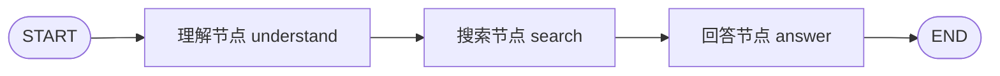
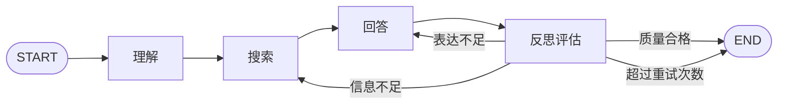
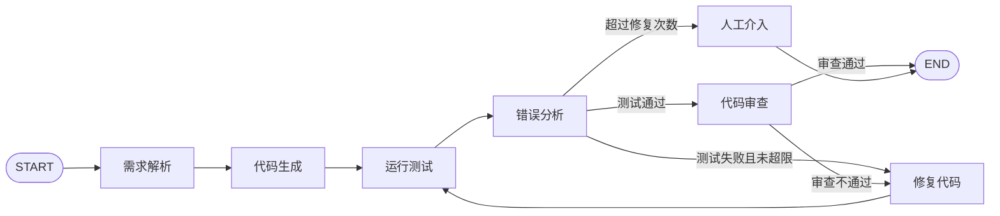

# 第六章 习题答案

> 来源章节：[第六章 框架开发实践](https://datawhalechina.github.io/hello-agents/#/./chapter6/%E7%AC%AC%E5%85%AD%E7%AB%A0%20%E6%A1%86%E6%9E%B6%E5%BC%80%E5%8F%91%E5%AE%9E%E8%B7%B5)
>
> 说明：原章节未附标准答案，以下为结合正文内容整理的参考答案与解题思路，便于复习和扩展实践。

## 1. 四种智能体框架的对比与设计哲学

### 原题

本章介绍了四个各具特色的智能体框架：`AutoGen`、`AgentScope`、`CAMEL` 和 `LangGraph`。请分析：

- 在 6.1.2 节的表 6.1 中，对比了这四个框架的多个维度。请选择其中两个你最熟悉的框架，从“协作模式”“控制方式”“适用场景”三个维度进一步深入对比。
- 本章提到了“涌现式协作”与“显式控制”之间的权衡，如何理解这两种设计哲学的含义。

### 参考答案

可以选择 `AutoGen` 与 `LangGraph` 进行对比。

| 维度 | AutoGen | LangGraph |
| --- | --- | --- |
| 协作模式 | 多智能体通过对话协作，角色之间不断交换消息 | 将任务流程拆成节点和边，由图结构驱动执行 |
| 控制方式 | 依赖群聊规则、角色提示词、终止条件和调度策略 | 依赖状态机、条件边、显式路由和节点函数 |
| 适用场景 | 需求探索、代码协作、头脑风暴、开放式多角色任务 | 金融审批、问答流水线、代码生成-测试-修复等强流程任务 |

“涌现式协作”强调给智能体设定角色、目标和互动规则，让复杂行为从对话中自然产生。它的优点是灵活、接近人类协作，适合开放问题；缺点是结果不够可预测，容易跑偏或循环。

“显式控制”强调开发者预先定义每一步流程、状态变化和跳转条件。它的优点是可靠、可审计、便于调试，适合生产级系统；缺点是需要写更多流程代码，灵活性和开放性相对弱。

## 2. AutoGen 软件开发团队的扩展设计

### 原题

在 6.2 节的 `AutoGen` 案例中，我们构建了一个“软件开发团队”。请基于此案例进行扩展思考：

> 提示：这是一道动手实践题，建议实际操作。

- 当前的团队使用 `RoundRobinGroupChat` 轮询群聊模式，智能体按固定顺序发言。如果需求变更，工程师的代码需要返回给产品经理重新审核，应该如何修改协作流程？请设计一个支持“动态回退”的机制。
- 在案例中，我们通过 `System Message` 为每个智能体定义了角色和职责。请尝试为这个团队添加一个新角色“测试工程师”（`Quality Assurance`），并设计其系统消息，使其能够在代码审查后执行自动化测试。
- `AutoGen` 的对话式协作存在可能的不稳定性，可能导致对话偏离主题或陷入循环。请思考：如何设计一套“对话质量监控”机制，在检测到异常时及时干预？

### 参考答案

动态回退机制可以把固定轮询改成“状态驱动的对话调度”。每轮发言后由一个调度器检查消息内容和任务状态：如果代码审查发现需求不一致，则将下一位发言者切回 `ProductManager`；如果只是实现缺陷，则切回 `Engineer`；如果审查通过，则进入 `QualityAssurance`；测试通过后交给 `UserProxy` 验收。

可维护一个状态对象：

```python
team_state = {
    "stage": "planning",
    "requirement_version": 1,
    "code_review_passed": False,
    "qa_passed": False,
    "rollback_reason": None,
    "round_count": 0
}
```

调度逻辑示例：

```python
def select_next_agent(state, last_message):
    if "需求变更" in last_message or "不符合需求" in last_message:
        state["stage"] = "replanning"
        return "ProductManager"
    if "代码需要修改" in last_message:
        state["stage"] = "implementation"
        return "Engineer"
    if "审查通过" in last_message:
        state["stage"] = "testing"
        return "QualityAssurance"
    if "测试通过" in last_message:
        state["stage"] = "acceptance"
        return "UserProxy"
    return "Engineer"
```

`Quality Assurance` 的系统消息可以这样设计：

```text
你是一名资深测试工程师，负责在代码审查通过后对应用进行自动化测试。
你的职责包括：
1. 根据需求和代码审查意见设计测试用例；
2. 检查功能正确性、异常处理、边界条件和安全风险；
3. 编写或建议可执行的测试脚本；
4. 汇总测试结果，明确给出“测试通过”或“测试失败”；
5. 如果测试失败，请列出复现步骤、失败原因和建议交给工程师修改的内容。
输出格式必须包含：测试范围、测试用例、执行结果、问题列表、最终结论。
```

对话质量监控可以从四类指标入手：主题相关性、重复度、进展度和轮次成本。实现上可以增加一个 `ConversationMonitor`，在每轮后评估：

- 最近 N 轮是否重复相同内容；
- 是否持续没有产出代码、测试结果或决策；
- 当前回复是否偏离用户需求；
- 是否超过最大轮次或 token 预算；
- 是否出现互相推诿、无法终止、无效工具调用等异常。

当检测到异常时，可以采取干预：重写任务摘要、强制指定下一位智能体、要求输出结构化结论、回退到上一个稳定状态，或直接终止并交给用户确认。

## 3. AgentScope 三国狼人杀案例分析

### 原题

在 6.3 节的 `AgentScope` 案例中，我们实现了一个“三国狼人杀”游戏。请深入分析：

- 案例中使用了 `MsgHub` 消息中心来管理智能体间的通信。请解释消息驱动架构相比传统函数调用的优势是什么？在什么场景下这种架构特别有价值？
- 游戏中使用了结构化输出（如 `DiscussionModelCN`、`WitchActionModelCN`）来约束智能体行为。请设计一个新的游戏角色“猎人”，并定义其对应的结构化输出模型，包括字段定义和验证规则。
- `AgentScope` 支持分布式部署，这意味着不同的智能体可以运行在不同的服务器上。请思考：在“三国狼人杀”这样的实时游戏场景中，分布式部署会带来哪些技术挑战？如何保证消息的顺序性和一致性？

### 参考答案

消息驱动架构的优势是解耦。传统函数调用通常是同步、点对点、调用方必须知道被调用方；而 `MsgHub` 可以把消息广播、路由、记录和分发统一管理，智能体只需要订阅和响应消息即可。这对多智能体游戏、多人协作、仿真系统、分布式任务调度特别有价值，因为参与者多、通信关系动态变化、事件顺序需要被记录。

“猎人”角色的结构化输出模型可以包含如下字段：

```python
from pydantic import BaseModel, Field, field_validator
from typing import Literal

class HunterActionModelCN(BaseModel):
    action: Literal["shoot", "skip"] = Field(description="猎人是否开枪")
    target_player: str | None = Field(default=None, description="被带走的目标玩家")
    reason: str = Field(description="行动理由")
    confidence: int = Field(ge=1, le=5, description="对目标身份判断的信心")

    @field_validator("target_player")
    @classmethod
    def target_required_when_shoot(cls, value, info):
        if info.data.get("action") == "shoot" and not value:
            raise ValueError("选择 shoot 时必须指定 target_player")
        if info.data.get("action") == "skip" and value:
            raise ValueError("选择 skip 时不应指定 target_player")
        return value
```

分布式部署的挑战包括网络延迟、消息乱序、重复投递、节点故障、时钟不一致、状态同步困难和玩家行动超时。可以通过以下方式保证顺序性和一致性：

- 为每条消息添加全局递增序号、游戏局 ID、阶段 ID 和回合 ID；
- 使用中心化消息队列或一致性日志作为单一事实来源；
- 对关键行动使用幂等处理，避免重复投票或重复技能释放；
- 每个阶段设置状态机，只允许合法状态转移；
- 使用 ACK、重试、超时和补偿机制处理网络异常；
- 定期快照游戏状态，方便故障恢复。

## 4. CAMEL 电子书协作案例扩展

### 原题

在 6.4 节的 `CAMEL` 案例中，我们让心理学家和作家协作创作电子书。

- 在案例中，协作会在检测到 `<CAMEL_TASK_DONE>` 标志时强制终止。但如果两个智能体意见分歧（一位认为可以终止，一位认为不应该终止），无法达成一致怎么办？请设计一个“冲突解决”的兼容机制。
- `CAMEL` 最初设计用于双智能体协作，但现在已经扩展支持多智能体。请查阅 `CAMEL` 的最新文档，了解其多智能体协作模块 `workforce`，并结合架构图说明其与 `AutoGen` 的群聊模式有何不同。

### 参考答案

冲突解决机制可以增加第三方“仲裁者”或“质量评估器”。当一个智能体输出 `<CAMEL_TASK_DONE>`，另一个智能体仍提出未完成项时，系统不立即结束，而是进入 `conflict_resolution` 状态：

1. 收集双方理由：一方说明为什么认为已完成，另一方列出未完成项。
2. 仲裁者根据任务目标、章节完整性、事实准确性、输出格式和质量标准打分。
3. 如果分数达标，则确认终止；如果未达标，则生成修订清单，要求继续协作。
4. 设置最大冲突轮次，避免无休止争论。

伪代码：

```python
if assistant_says_done and user_disagrees:
    verdict = judge.evaluate(task_goal, current_artifact, done_reason, objections)
    if verdict.accept:
        stop()
    else:
        continue_with_revision(verdict.revision_plan)
```

`CAMEL workforce` 更像一个有任务分解、人员配置和管理者协调的“工作队伍”。它通常强调把复杂任务拆分给不同 worker，并由协调机制管理任务分配、执行和汇总。`AutoGen` 的群聊模式更像一个会议室：多个智能体在同一对话空间中轮流或按规则发言，通过消息互动推动任务。

因此二者差异可以概括为：

| 维度 | CAMEL Workforce | AutoGen 群聊 |
| --- | --- | --- |
| 组织形式 | 更像任务团队与工作流管理 | 更像多角色对话会议 |
| 协作核心 | 任务分解、分配、执行、汇总 | 消息交换、角色发言、对话推进 |
| 控制粒度 | 更偏任务级管理 | 更偏对话级管理 |
| 适合场景 | 复杂项目拆解、多专家协同产出 | 角色扮演、代码协作、讨论式问题求解 |

## 5. LangGraph 三步问答助手扩展

### 原题

在 6.5 节的 `LangGraph` 案例中，我们构建了一个“三步问答助手”。请分析：

- `LangGraph` 将智能体流程建模为状态机和有向图。请画出案例中“理解-搜索-回答”流程的图结构，标注节点、边和状态转换条件。
- 当前的助手是一个线性流程。请扩展这个案例，添加一个“反思”节点：如果生成的答案质量低（例如过于简短或缺乏细节），系统应该重新搜索或重新生成答案。请设计这个循环机制的条件边逻辑。
- `LangGraph` 的优势在于对循环的原生支持。请设计一个更复杂的应用场景，充分利用这一特性：例如“代码生成-测试-修复”循环、“论文写作-审阅-修改”循环等。要求画出完整的图结构并说明关键节点的功能。

### 参考答案

原始三步问答助手可以表示为：



状态字段可以包括：

- `user_query`：原始问题；
- `search_query`：理解后生成的搜索词；
- `search_results`：搜索结果；
- `final_answer`：最终答案；
- `step`：当前阶段，如 `understood`、`searched`、`search_failed`、`completed`。

加入“反思”节点后，可以把流程扩展为：



反思节点可以检查答案长度、是否引用搜索结果、是否覆盖用户问题、是否包含明显不确定表达、是否缺少步骤或细节。条件边逻辑示例：

```python
def route_after_reflection(state):
    if state["retry_count"] >= 2:
        return "end"
    if state["quality_score"] >= 4:
        return "end"
    if state["issue_type"] == "missing_evidence":
        return "search"
    if state["issue_type"] == "too_brief":
        return "answer"
    return "answer"
```

更复杂的“代码生成-测试-修复”循环：



关键节点功能：

- 需求解析：把用户需求转为规格、约束和验收标准；
- 代码生成：生成初版实现和测试；
- 运行测试：执行单元测试、集成测试或静态检查；
- 错误分析：解析失败日志，定位错误类型；
- 修复代码：根据错误和审查意见修改实现；
- 代码审查：检查可维护性、安全性和边界条件；
- 人工介入：当循环无法收敛时交给人类确认。

## 6. 产品级框架选型

### 原题

框架选型是智能体产品开发过程中的关键决策之一。假设你是一家 `AI` 公司的技术架构师，公司计划开发以下三个智能体产品应用，请为每个应用选择最合适的框架（`AutoGen`、`AgentScope`、`CAMEL`、`LangGraph` 或不借助框架从零开发），并详细说明理由：

**应用 A**：智能客服系统，需要处理大量并发用户请求（每秒 1000+），要求响应时间低于 2 秒，系统需要 7×24 小时稳定运行，并支持水平扩展。

**应用 B**：科研论文辅助写作平台，需要一个“研究员智能体”和一个“写作智能体”深度协作，共同完成文献综述、实验设计、数据分析和论文撰写。要求智能体能够进行多轮深度讨论，自主推进任务。

**应用 C**：金融风控审批系统，需要按照严格的流程处理贷款申请：资料审核 → 风险评估 → 额度计算 → 合规检查 → 人工复核 → 最终决策。每个环节都有明确的判断标准和分支逻辑，要求流程可追踪、可审计。

### 参考答案

应用 A 推荐 `AgentScope`，也可以结合自研服务治理组件。原因是该场景的核心不是“对话是否有趣”，而是高并发、低延迟、可扩展、可运维。`AgentScope` 强调工程化、多智能体平台能力、消息机制和分布式部署，更适合构建 7×24 小时稳定服务。实际落地还需要配合缓存、限流、队列、熔断、监控和负载均衡。

应用 B 推荐 `CAMEL`。该场景需要两个专家角色进行多轮深度讨论，任务具有开放性和创造性，重点在于角色互补和自主推进。`CAMEL` 的角色扮演和 Inception Prompting 适合让“研究员”和“写作智能体”围绕共同目标持续协作。若后续扩展到更多专家角色，可以考虑 `workforce` 类多智能体组织方式。

应用 C 推荐 `LangGraph`。金融风控审批要求流程严格、状态可追踪、分支可解释、结果可审计。`LangGraph` 的状态机和有向图模型天然适合表达“资料审核 → 风险评估 → 额度计算 → 合规检查 → 人工复核 → 最终决策”的流程，并能通过条件边处理拒绝、补充材料、人工复核、重新评估等分支。相比对话式框架，显式图结构更符合金融场景的合规要求。

总结：

| 应用 | 推荐框架 | 选型理由 |
| --- | --- | --- |
| A 智能客服 | AgentScope | 高并发、分布式、工程化和稳定运行 |
| B 论文写作 | CAMEL | 双角色深度协作、开放式讨论、自主推进 |
| C 金融风控 | LangGraph | 显式流程、条件分支、可追踪、可审计 |
